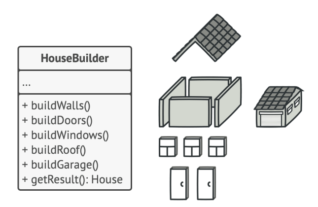

# Builder Pattern

The **Builder Pattern** is a creational design pattern that separates the construction of a complex object from its representation. The pattern allows you to produce different types and representations of an object using the same construction code.

### When to use

- When you need to add multiple attributes to the same class
- Creating complex objects step-by-step while keeping the object immutable, while the construction process flexible.

### Director Class

- The director class defines the order in which to execute the building steps
- The builder provides the implementation for those steps.

### File Explanation

- Recreated this pattern from RefactoringGuru, has 2 Builders `WoodenHouseBuilder` and `FancyHouseBuilder`.
- Has 2 directors: `UniqueHouseDirector` and `SharedHouseDirector`.
- `UniqueHouseDirector`:
    - Only one director can own a builder at a time.
    - Once you move a unique_ptr into the director, it cannot be reused outside.
- `SharedHouseDirector`:
    - Multiple directors can share the same builder.
    - Each director can call `construct()`
