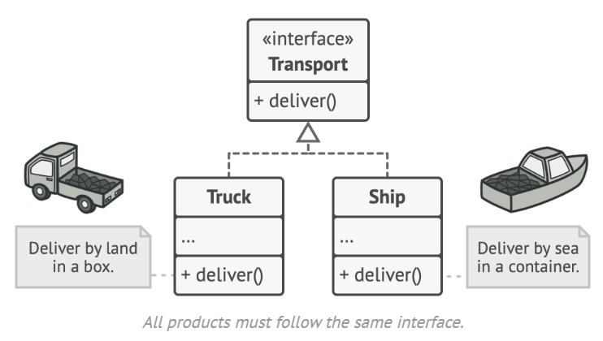

# Factory Method

- The Factory Method pattern suggests that you replace direct object construction calls to a special factory method.
- Don’t worry: the objects are still created using smart pointers, but it’s being called from within the factory method. 
- Objects returned by a factory method are often referred to as 'products'.

### When to use

- Decoupling client code from concrete implementations
- Adding new transport types (e.g., Plane) only requires modifying the factory, not the client.

### File Explanation

- Abstract Parent Class `Transport`
- 2 subclasses `Truck` and `Ship`
- `TransportFactory` which creates each transportation separate from main code.
